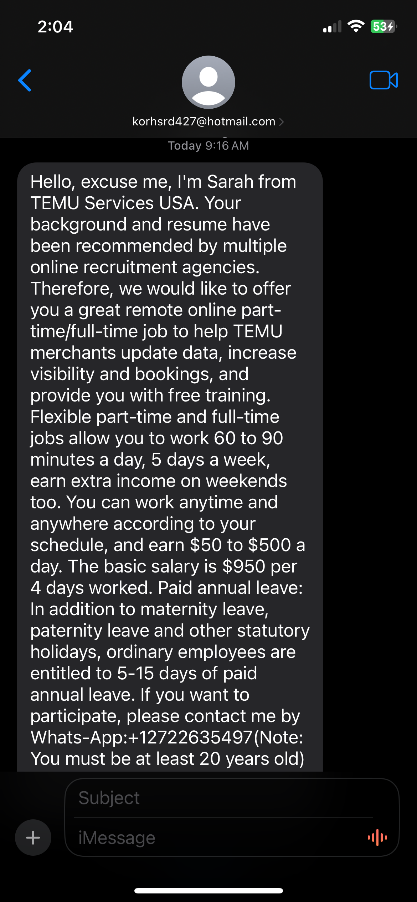

# Analyzing Signs of a Smishing Attempt  

## The Message:  

I recently received an iMessage from an unknown Hotmail address:  

`korhsrd427@hotmail.com`  

They were offering me a job 🎉! 

Unfortunately for them, the red flags were blazing, and I wasn’t falling for it.  

For those who might not recognize the signs of a smishing attempt, here’s a breakdown of the **red flags** and the **TTPs** the threat actor employed:  

## Red Flags  

1. **Free Email Domain**:  
   - Legitimate businesses typically use a corporate email domain (e.g., `@temu.com`), not free providers like `@hotmail.com`. This usually indicates the sender is fraudulent.  

2. **No Personalization**:  
   - The message didn’t address me by name, which is a common sign of phishing or smishing. Personalized messages are less likely to be ignored but harder for scammers to generate at scale.  

3. **I Didn’t Apply to TEMU**:  
   - Always be skeptical of unsolicited offers, especially for positions you didn’t apply for.  

4. **Poor Grammar and Execution**:  
   - The text is riddled with errors and run-on sentences. Professional communication would be polished and concise.  

5. **WhatsApp Contact Information**:  
   - Businesses typically direct you to corporate emails or an official website. Including a WhatsApp number is a major red flag.  

---

## Threat Actor TTPs  

Here’s a breakdown of some of the **Tactics, Techniques, and Procedures (TTPs)** used by this threat actor:  

1. **Delivery Mechanism**:  
   - **Tactic**: *Social engineering via SMS (smishing)*  
   - The threat actor used iMessage to deliver the bait, exploiting the instant and personal nature of mobile communication.  

2. **Impersonation**:  
   - **Technique**: *Fake job opportunity from a well-known brand*  
   - By referencing TEMU, they aimed to exploit the trust and familiarity associated with a recognizable company.  

3. **Urgency and Exploitation of Emotions**:  
   - **Procedure**: *Preying on job seekers’ desperation*  
   - The message capitalized on economic uncertainty and the natural excitement of receiving a job offer, pushing recipients to act without thinking.
     
---

## Conclusion  

This smishing attempt shows how threat actors adapt their methods to exploit vulnerable individuals.

If you encounter a message like this, remember the red flags and **pause before you engage**. Threat actors count on you reacting emotionally rather than rationally. 
